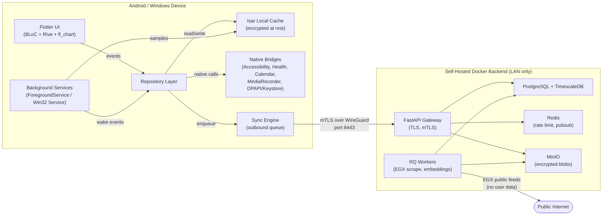
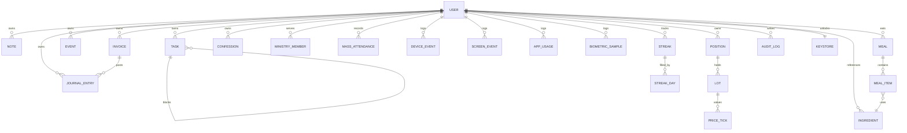
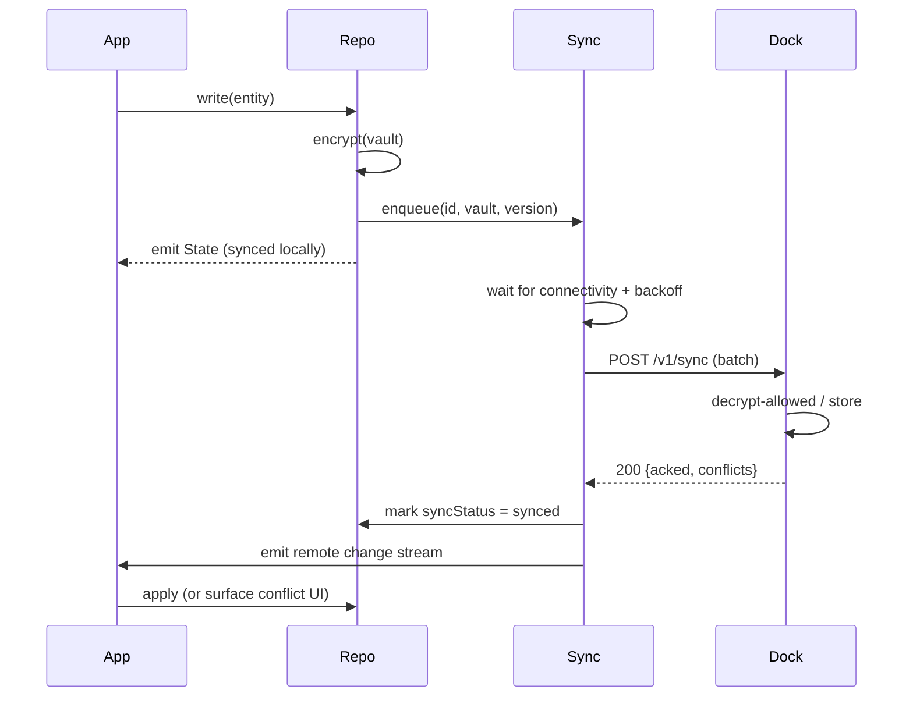

# Pillar — Architecture

> System topology, tech stack, data model, security, and sync protocol.
> This file is the *how* at the system level. Code-level contracts live in
> `agents.md`. Visual-level contracts live in `design.md`.

---

## 1. System Topology



### 1.1 Layering rules

| Layer                  | May depend on                       | Must not depend on                  |
| ---------------------- | ----------------------------------- | ----------------------------------- |
| `ui/` (widgets)        | `bloc/`, `design/`                  | `data/`, `native/`, network         |
| `bloc/`                | `domain/`, `data/` (via repository) | `ui/`, `native/` directly           |
| `domain/`              | nothing                             | anything                            |
| `data/` (repositories) | `domain/`, `isar/`, `sync/`, `native/` | `ui/`, `bloc/`                  |
| `native/` (bridges)    | platform APIs only                  | anything in `lib/` except models    |
| `sync/`                | `data/`, `dock/` client             | `ui/`, `bloc/`                      |
| `dock/`                | FastAPI, Postgres                   | `lib/`                              |

A circular import between pillars is a build-time error caught by `tachyon`
(or `import_lint`).

---

## 2. Tech Stack Inventory

### 2.1 Flutter runtime

| Concern               | Choice                        | Version (target) | Rationale                                                                                  |
| --------------------- | ----------------------------- | ---------------- | ------------------------------------------------------------------------------------------ |
| Framework             | Flutter                       | 3.24+            | Hard requirement of the brief.                                                             |
| State management      | `flutter_bloc`                | 8.1+             | Hard requirement. Cubit used for trivial state.                                            |
| Local DB              | `isar` (+ `isar_flutter_libs`)| 3.1+             | Hard requirement. Reactive queries, transactional, fast on mobile.                         |
| DI                    | `get_it` + `injectable`       | 7.6 / 2.4        | Annotation-based, no codegen surprises, plays well with BLoC.                              |
| Routing               | `go_router`                   | 14+              | Declarative, deep-link friendly, supports shell routes for the pillar tabs.                |
| Charts                | `fl_chart`                    | 0.69+            | Hard requirement. Canvas-accelerated, gesture-aware.                                       |
| Animation (complex)   | `rive`                        | 0.13+            | State-machine animations for the mascot, the Decision Break shield, the streak grid.       |
| Animation (tween)     | `flutter_animate`             | 4.5+             | Declarative, code-splitting friendly, no codegen.                                          |
| Calendar (local)      | `device_calendar`             | 4.3+             | Talks to the Android `CalendarContract` provider; read/write Samsung & local calendars.    |
| Google Calendar       | `googleapis` (Dart port)      | latest           | User-owned OAuth client. Tokens stored in OS keyring, never on backend.                    |
| Health                | `health`                      | 10+              | Hard requirement. Health Connect on Android.                                               |
| Wake word             | `picovoice_flutter` (Porcupine) | 3.x            | Offline, on-device, free tier covers one user.                                             |
| Audio capture         | `record`                      | 5.x              | PCM stream for the wake-word engine. Never written to disk in raw form.                    |
| Background tasks      | `flutter_background_service`  | 5.x              | Android Foreground Service; on Windows we use a `Win32 Service` via FFI.                   |
| Secure storage        | `flutter_secure_storage`      | 9.x              | Wraps Android Keystore and Windows DPAPI.                                                  |
| Local encryption      | `cryptography` (x25519, AES)  | 2.7+             | Argon2id, AES-256-GCM, XChaCha20-Poly1305 where AEAD is needed.                            |
| HTTP                  | `dio` + `dio_cache_interceptor` | 5.x            | The cache interceptor lets us serve "fresh-enough" data when the Dock is unreachable.      |
| Connectivity          | `connectivity_plus`           | 6.x              | Drives sync-engine backoff.                                                                |
| Logging               | `logger` (local) + custom sink | 2.x             | Never logs to a remote endpoint.                                                           |
| Crash diagnostics     | `sentry_flutter` (self-hosted) | 8.x              | Pointed at the user's own Sentry container, scrubbed of PII.                                |
| Testing               | `flutter_test`, `mocktail`, `bloc_test`, `patrol` | —  | Unit + widget + integration.                                                              |
| Build / CI            | Melos (monorepo), Fastlane, GitHub Actions | —    | Deterministic builds with `--obfuscate --split-debug-info`.                                |

### 2.2 Native modules

| Platform | Module           | Purpose                                                                  |
| -------- | ---------------- | ------------------------------------------------------------------------ |
| Android  | `pillar_android` | Accessibility service, foreground service, MediaProjection, Calendar.    |
| Windows  | `pillar_windows` | SetWindowsHookEx for input, UIA for app state, Win32 service, DPAPI.     |
| Shared   | `pillar_crypto`  | C ABI for the Argon2id → AES-GCM pipeline (reused on both platforms).    |

### 2.3 Backend ("the Dock")

| Service       | Image                       | Why                                                      |
| ------------- | --------------------------- | -------------------------------------------------------- |
| `traefik`     | `traefik:v3.1`               | TLS termination, mTLS, ACME via internal CA.             |
| `api`         | Custom (FastAPI + Uvicorn)   | Sync API, EGX proxy endpoints, embedding service.        |
| `db`          | `timescale/timescaledb:2.16`| Time-series for telemetry; relational for finance.       |
| `cache`       | `redis:7-alpine`            | Rate limit, session cache, pubsub for live updates.      |
| `worker`      | Custom (Python RQ)          | EGX scraper, calendar conflict resolver, embedder.       |
| `storage`     | `minio/minio:RELEASE.2024-09` | Encrypted blobs (audio checkpoints, exports).          |
| `wireguard`   | `linuxserver/wireguard`     | Site-to-device VPN so the app reaches the Dock remotely. |
| `sentry`      | `getsentry/self-hosted`     | Crash diagnostics, scrubbed.                             |
| `backup`      | `restic` + `rclone`         | Encrypted off-site backups of the volume.                |

All containers run on a single `kero-net` bridge network. Only `traefik` and
`wireguard` publish ports to the LAN. The Postgres volume is encrypted with
LUKS at rest; the MinIO bucket is encrypted with SSE-KMS whose key is sealed
inside a HashiCorp Vault running on the same host.

---

## 3. Security & Cryptography Foundation

### 3.1 Key hierarchy

```
                        ┌───────────────────────────┐
                        │  User passphrase (memory)  │
                        └─────────────┬─────────────┘
                                      │ Argon2id (m=64MiB, t=3, p=2)
                                      ▼
                        ┌───────────────────────────┐
                        │   Master Key (MK) 256-bit  │ ← lives only in RAM
                        └─────────────┬─────────────┘
                                      │ HKDF-SHA256 (info="pillar")
                                      ▼
            ┌──────────────┬──────────────┬──────────────┐
            ▼              ▼              ▼              ▼
        KEK.spirital  KEK.health    KEK.financial   KEK.session
            │              │              │              │
            │ AES-KW       │ AES-KW       │ AES-KW       │ (raw use)
            ▼              ▼              ▼              ▼
        DEK.spiritual  DEK.health   DEK.financial   session-token
        (per-vault)    (per-vault)  (per-vault)    (per-launch)
```

* **MK** is held in `Keyring` (a singleton guarded by an `AtomicReference`).
  It is zeroed on app background, on biometric failure, and after 5 min of
  inactivity.
* **KEKs** (key-encryption-keys) encrypt the **DEKs** (data-encryption-keys)
  for each vault and are stored inside the Isar `keystore` collection.
* **DEKs** never leave the device. The Dock receives ciphertext + the
  KEK-wrapped DEK only if the user has explicitly enabled remote sync of
  that vault. The Pillar 5 (Spiritual) vault can never be remotely synced.

### 3.2 Vaults

| Vault             | Pillars                       | Remote sync | Notes                                |
| ----------------- | ----------------------------- | ----------- | ------------------------------------ |
| `default`         | Productivity, Analytics       | yes         | Default. Encrypted at rest in Dock.  |
| `health`          | Health                        | yes         | Encrypted at rest in Dock.           |
| `financial`       | Wealth                        | yes         | Encrypted at rest in Dock.           |
| `spiritual`       | Spiritual                     | **no**      | Device-only. Even ciphertext never leaves. |

### 3.3 Transport

* All Dock traffic is **mTLS** (client cert signed by the internal CA).
* The client cert is generated on first launch, sealed with KEK.session, and
  never leaves the device unencrypted.
* DNS for the Dock is a `*.kero.local` zone served by the WireGuard
  container's internal resolver — no public DNS lookups.

### 3.4 Threat model (abbreviated STRIDE)

| Threat                                       | Mitigation                                                                |
| -------------------------------------------- | ------------------------------------------------------------------------- |
| **S**poofing of the Dock                     | mTLS, internal CA, cert pinning.                                          |
| **T**ampering of on-device cache            | AES-256-GCM at rest; Isar pages are wrapped at the schema level.           |
| **R**epudiation of edits                     | Append-only `audit_log` Isar collection; mirrored to Dock.                 |
| **I**nformation disclosure of vault data     | Vaults are client-encrypted; Dock stores ciphertext only.                  |
| **D**oS of the Dock                          | Rate limit in Traefik, Redis token bucket, backoff in the sync engine.    |
| **E**oP via malicious plugin / model         | No plugin system. LLM "Coach" runs sandboxed, read-only.                   |

---

## 4. Data Model (Isar Schema)

Isar is a NoSQL object store. We model it as a **collection family per pillar**
with explicit `Id` foreign keys. The schema is owned by `architecture.md`; the
field-level contracts live in `agents.md`.

### 4.1 Conceptual ERD



### 4.2 Collection families

| Family                | Pillar        | Encryption    | Notes                                          |
| --------------------- | ------------- | ------------- | ---------------------------------------------- |
| `notes`, `tags`       | Productivity  | default       | Full-text search via FTS5 mirror.              |
| `tasks`, `task_links` | Productivity  | default       | DAG via adjacency list.                        |
| `events`              | Productivity  | default       | Mirrors Samsung + Google Calendar.             |
| `invoices`, `journal_entries`, `accounts`, `currencies`, `fx_rates` | Wealth | financial | Double-entry. |
| `positions`, `lots`, `price_ticks`, `dividends` | Wealth | financial | EGX-specific. |
| `confessions`, `ministry_members`, `ministry_tasks`, `mass_attendance`, `streaks`, `streak_days` | Spiritual | spiritual | `spiritual` vault is device-only. |
| `device_events`, `screen_events`, `app_usage`, `biometric_samples` | Omniscient / Health | default / health | Time-series; indexed on `ts`. |
| `meals`, `meal_items`, `ingredients`, `recipes` | Health | health | Ingredient reference data. |
| `audit_log`           | Foundation    | default       | Append-only. |
| `keystore`            | Foundation    | OS-backed     | Wrapped DEKs.                                  |

### 4.3 Sync vectors

Every collection carries:

```dart
@Index(composite: [CompositeIndex('vault'), CompositeIndex('updatedAt')])
late DateTime updatedAt;

@enumerated
late SyncStatus syncStatus; // pending, syncing, synced, conflict

late int syncVersion; // monotonically increasing per (vault, id)
```

The sync engine uploads only rows whose `syncStatus == pending` and respects
the per-vault policy (see §3.2). On the server side, the latest
`syncVersion` wins; conflicts are surfaced in the in-app **Reconciliation
Inbox** for manual resolution.

### 4.4 Time-series layout

`device_events`, `screen_events`, `app_usage`, and `biometric_samples` are
mirrored into TimescaleDB hypertables partitioned by 7-day chunks. The
Flutter side stores them in Isar with a `ts` index for local queries; the
Dock stores the long-term archive.

---

## 5. Sync Protocol



### 5.1 Guarantees

* **At-least-once delivery.** The sync queue is durable in Isar; the app
  retries until the Dock acks.
* **Idempotency.** Each row carries `(vault, id, syncVersion)`. The Dock
  dedupes on `(vault, id, syncVersion)`.
* **Causal ordering.** Within a vault, `syncVersion` is monotonic per
  client. The Dock also stores a per-vault **vector clock** to detect
  concurrent writes from a second device.
* **Conflict UI.** A `ConflictEntity` collection is created for any row
  where the Dock's `syncVersion` differs from ours. The Reconciliation
  Inbox BLoC shows a side-by-side diff and lets the user pick local or
  remote.

### 5.2 Backoff

Exponential backoff with jitter, capped at 5 min. If the Dock is
unreachable for > 24 h, the app degrades to **offline-only** and surfaces a
banner. No data is ever lost; the queue just grows.

---

## 6. Background Service Registry

| Service                 | Platform | Manifest permission                 | Lifespan                                          |
| ----------------------- | -------- | ----------------------------------- | ------------------------------------------------- |
| `AppForegroundProbe`    | Android  | `QUERY_ALL_PACKAGES` (user-acknowledged) | Foreground service, notification "Tracking app usage" |
| `AppForegroundProbe`    | Windows  | N/A (own service)                   | Win32 Service, started by SCM                     |
| `InputAccessibility`    | Android  | `BIND_ACCESSIBILITY_SERVICE`        | Bound to the user's a11y permission                |
| `InputAccessibility`    | Windows  | N/A (own hook DLL)                  | `SetWindowsHookEx(WH_MOUSE_LL, WH_KEYBOARD_LL)`  |
| `ScreenStateListener`   | Android  | `RECEIVE_BOOT_COMPLETED`            | BroadcastReceiver registered at boot               |
| `ScreenStateListener`   | Windows  | N/A                                 | `WTSRegisterSessionNotification`                   |
| `WakeWordEngine`        | Android  | `FOREGROUND_SERVICE_MICROPHONE`     | Foreground service with mic indicator             |
| `WakeWordEngine`        | Windows  | N/A                                 | WasapiCapture loop                                 |
| `HealthIngest`          | Android  | `ACTIVITY_RECOGNITION` + Health Connect | WorkManager periodic 15-min job                 |
| `HealthIngest`          | Windows  | N/A                                 | No equivalent; v1 is Android-only for Health      |
| `SyncEngine`            | Both     | `INTERNET` (no broad access)        | Driven by `WorkManager` / `TaskScheduler`         |
| `CalendarReconciler`    | Android  | `READ_CALENDAR`, `WRITE_CALENDAR`   | WorkManager 30-min job                            |
| `CalendarReconciler`    | Windows  | N/A                                 | v1 uses Google API only on Windows                 |

### 6.1 Battery & privacy guarantees

* The wake-word service uses a **VoiceInteractionService** on Android 12+,
  which can listen without the visible mic indicator when the user has
  opted in to "Hey Kero" — but we **always** show the mic indicator to
  preserve user trust.
* The Accessibility service is registered only after the user completes the
  in-app onboarding; we never auto-grant via shell commands.
* All foreground services ship with a persistent low-priority notification
  explaining what the service is doing, in the user's locale.

---

## 7. Cross-Platform Abstraction

A single `package:pillar_core` Dart API is implemented twice:

```dart
abstract class PillarPlatform {
  Future<void> requestAccessibilityConsent();
  Stream<ForegroundAppChange> get foregroundAppStream;
  Stream<ScreenStateChange> get screenStateStream;
  Future<void> installOemCalendarProvider();
  Future<Uint8List?> readDpapiSecret(String key);
  Future<void> writeDpapiSecret(String key, Uint8List value);
  Stream<AudioSample> get micStream; // 16 kHz mono PCM
}
```

Implementations:

* `PillarPlatformAndroid` (Kotlin) — `MainActivity` exposes a `MethodChannel`
  and a `BasicMessageChannel` for the high-frequency audio stream.
* `PillarPlatformWindows` (C++ via FFI) — wraps the Win32, UIA, and WASAPI
  APIs.

This is the only place platform-specific code lives. BLoCs and repositories
import only `PillarPlatform`.

---

## 8. Performance Budgets

| Metric                                   | Budget       | Measured by                                 |
| ---------------------------------------- | ------------ | ------------------------------------------- |
| Cold start to interactive                | ≤ 1.8 s      | Patrol scenario on Honor Magic 6 Pro        |
| Frame time, 99th percentile, idle UI     | ≤ 16 ms      | Flutter DevTools "Performance" overlay       |
| Frame time, 99th percentile, chart pan   | ≤ 24 ms      | Same, with 10k-point dataset                |
| Wake-word end-to-end latency             | ≤ 400 ms     | Synthetic beep test                         |
| Decision Break overlay render            | ≤ 200 ms     | Patrol foreground probe                     |
| Isar read, 95p, 1k rows                   | ≤ 30 ms      | `flutter test --tags perf`                  |
| Sync round-trip, 100 rows                | ≤ 1.2 s      | Local Docker harness                        |
| APK size (universal, obfuscated)         | ≤ 60 MB      | `flutter build apk --analyze-size`          |
| Windows installer                        | ≤ 120 MB     | `flutter build windows`                     |

---

## 9. Observability

* **Logs** — `logger` writes to a rolling file in the app's documents
  directory. Files are capped at 5 MB × 5 rotations. The Diagnostics screen
  lets the user share a scrubbed bundle (regex-redacts emails, IBANs, etc.).
* **Metrics** — `pprof` snapshots on the Dock; the app exposes a `/metrics`
  endpoint when in debug mode.
* **Tracing** — OpenTelemetry spans on every sync batch; spans carry no
  payload, only IDs.
* **Crashes** — Sentry (self-hosted). `beforeSend` hook strips PII.

---

## 10. Build, Release, and Signing

* **Android**: `keystore.jks` stored outside the repo, mounted at build
  time. `minifyEnabled true`, `shrinkResources true`, `useProguard true`.
  App Bundle only, never APK in production.
* **Windows**: Authenticode cert from a local CA (no public CA — this app
  is for one user). MSIX packaging, auto-update via `windows_bootstrap`.
* **Dock**: Multi-arch images (`linux/amd64`); pinned digests in
  `docker-compose.yml`. Watchtower is **not** used; updates are manual
  after a `docker compose pull && docker compose up -d` ritual.

---

## 11. Non-Goals (architectural)

We are explicitly **not** building any of the following, and the architecture
must not be shaped to anticipate them:

* Multi-user, multi-tenant, RBAC.
* Realtime collaborative editing.
* A mobile web client.
* Federated sync between two Docks.
* A marketplace, a plugin system, or third-party extensions.

These would require a different data model and a different threat model.
If any of them become a v2.0 goal, the architecture will be revisited in a
new `pillar_v2.md` document — not retrofitted.

---

*End of architecture.md. See `design.md` for the user-facing design system.*
